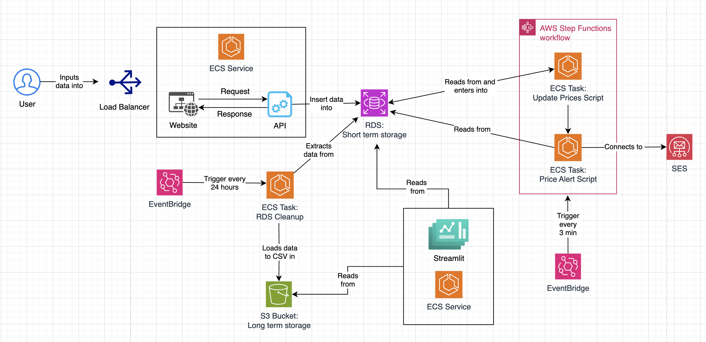

# Sales Tracker

Welcome to the Sales Tracker Repository!

Ever lost out on buying a product because you wanted to wait until it was on sale, and then the product sold out before you had a chance to buy it? Well with this repo that problem can disappear! All you have to do is subscribe to a product you want to track and be prepared to check your emails for when it goes on sale! It's as simple as that. 

## Cloud Architecture
A high level overview of the cloud architecture can be seen below:

### How it works

#### Pipeline
This pipeline acts as more of a web scraper that extracts data from an api and different web pages. This is then loaded into a database for short term storage (see [Storage](#Storage)). This is triggers every time a user makes a POST request to the API (i.e. adding a product/deleting a subscription).

#### Storage
There are 2 options for storage:

1. Short Term storage 
  - This is a PostgreSQL server with an RDS database. 

2. Long Term storage 
  - This will be an S3 bucket containing csv files from each day. The csv files contain all of the data from the previous days RDS database and then resets the database ready for the current day. This will be triggered by an EventBridge. The triggered will is an ECS task that reads from the RDS and uploads the content to a csv file within an S3 bucket. 

#### Emailing Service

There are many emailing services throughout this project:

1. New User Sign up - A user will receive an email via SES when they are initially added to the product system asking them to verify their identity. Only after the user verifies their identity will they be able to receive the following emails. 

2. Price drop email - A user will receive an email via SES when a product they are subscribed to has dropped in price (i.e. gone on sale). The user will receive this email within 3 minutes of the price dropping in order to maximize the chances of successful user purchase. 

[TO-DO]: Add in any more emails that are going to be made!

#### Dashboard

[TO-DO]: Write summary for dashboard. 

## Entity Relationship Diagram (ERD)

An ERD which clearly describes the tables in the schema and the data stored in each table:

#### Users Table

This table will be where the users personal information will be uploaded to. This includes their email, first and last name, and phone number. The email and phone number are essential fields that are required depending on whether the user wants to be notified by email or text message. 

#### User Preference Table

This table is filled in last as it depends on the product id and user id, whilst inserting the users preference for the price reduction they want to be notified at.

#### Products Table

This table contains the information necessary for the product when initially uploaded to the database. This includes the product id, product name, url and website id of the product. This table also depends on the prices table. If a product is not in the table then a new row will be created within the table. 

#### Prices Table

This table will be continuously updated and will contain the price of each product over time. This table refers to the product id whilst including the price, and the time the price was recorded.

#### Websites Table

This table stores the different websites to be tracked. This allows users to easily see the different websites they can use to track products.

## Files explained

[TO-DO]: Write out what all the files do.

